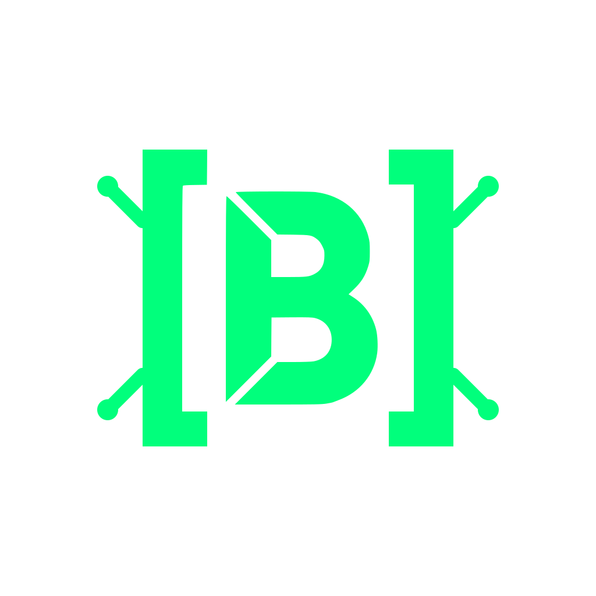

# Briev: A Programming Language
<sub>(Briev is pronounced and was formerly known as 'Brief', but that name was overrepresented.)</sub> 
### TL;DR

Briev is a programming language with the following features:

- Contract driven partial correctness verification (without needing to write essays of formal proof)
- Partially declarative, partially imperative, functional invariant based programming
- Invariant based runtime optimization (with execution speed at parity, or even better than C in several cases)
- Backend independence through state-management based syntax and backend handling of intrinsics
- Backend targeting by extension (`.bv`, `.ebv`, `.rbv`, `.abv`, `.sbv`)
- A lightweight systems language that handles complexity at compile time
- Syntax that is equally applicable to the other backends, not just systems programming
- Inferred command flow through reactive top level `node` declarations
- Memory management by proof through AST graphing
- Syntax which encourages and optimizes for flat programming
- Exhaustive `match` with enum construction — patterns are checked, missing arms are errors
- First-class function values — pass any named function where a callable type is expected
- Typed event ports on objects (SPEC §9.5) with deterministic event delivery
- Legible metaprogramming syntax for macros and compiler plugins with intermediate `.beast` AST files for understanding how the compiler transforms the code
- The Metropolitan FFI which adapts compiled Briev code to any and every other programming language by adapting their calling and memory conventions through the Metropipe and GLUE system
- Helpful compiler hints on failed compilation — did-you-mean suggestions, removed-form diagnostics with fix paths
- Optional Python-like indent-based syntax for those who despise curly braces through the opt-in `.f` dotted profile
- Optional extra strictness through the `.s` dotted profile — representation fallbacks become hard errors
- A conformance sweep that requires every source file in the repo to parse and typecheck — regressions find themselves
- Extensible compile-time literals
- A highlighter shipped with the repo

And for those people for whom this is very important, even if the language itself is already robust enough:

- A cute mascot called _Syn_

| <br/> <p align="center">*Syn*, the Cybersphinx<p> <p align="center"><sup><sub>(For those people who like a mascot to come with their language)</sup></sub><p> | <br/><p align="center">**Briev**<p><br/><p align="center">**Embedded Briev**<p><br/><p align="center">**Accelerated Briev**<p> | <br/><p align="center">**Rendered Briev**<p><br/><p align="center">**Data Briev**<p><p align="center">**Silicon Briev**<p> |
|---|---|---|

## Briev Doesn't Break

Briev is a contract-enforced language designed for building verifiable state machines. It treats program execution as a series of verified state transitions rather than sequential instructions. The file extension selects the compilation target. Each one optimizes the same contract-proven logic for a different material:

| Extension | Variant | Compiles to |
|-----------|---------|-------------|
| `.bv` | **Briev** | LLVM native binary (optional SPIR-V offload) |
| `.rbv` | **Rendered Briev** | TypeScript + frontend code + WASM sidecars |
| `.ebv` | **Embedded Briev** | LLVM microcontroller binary |
| `.abv` | **Accelerated Briev** | SPIR-V GPU kernel |
| `.sbv` | **Silicon Briev** | CIRCT hardware description (Verilog/VHDL) |
| `.dbv` / `.dbvl` | **Data Briev** | Configuration data parsed by Briev itself |

The main sources of inspiration are Rust (by Graydon Hoare and the Rust community) and Dialog (by Linus Åkesson). Specifically the fact that both have a very strict compiler, that catches bad code before it ever compiles, simply through smart conventions. Especially the declarative nature is inspired by Dialog, as a direct successor of Prolog, since Dialog showed that setting up a series of predicates could be sufficient to have a compiler figure out a complex runtime capable of simulating a world. And the reactor loop? That was inspired by, well... React. As such, everything in Briev is designed to, in some way, aid in predictable runtime cascades. You set up the first billiard ball, and based on the variables present describing the overall "state", the rest of the balls predictably scatter.

Note that much of this language design was inspired by designing a language that would be impossible for an LLM to get wrong. Therefore it feels important to me to disclaim a lot of AI has been used in building this compiler. The design is fully my own (Randy Smits-Schreuder Goedheijt), but much of the programming was handled by LLMs, and the verification by hand and a series of unit tests (which LLMs somehow manage to cut the corners of). As such, you will find comments, markdown files and many more typical signs of LLM usage in this repository. These all exist to help steer the LLM into *correctly* modifying and applying the design decisions I have made, as it would otherwise be prone to hallucinate a novel language like this. Ergo, you will find a veritable library of markdown files written by AI, just to make sure everything got documented as I went.

If you've gotten this far, I thank you for reading, and I hope you will have enjoyed your *Briev* time here so far.

Regards,

**Randy**

## The Thesis: Topology over Timing

Most programming languages are built around _operations in sequence_. Briev describes the _sequence of operations_ — the spatial connections between logical states.

*   **Logic as a Map:** Briev defines a world where roads exist all at once. The "sequence" is then better called a _connection_, not the _timing_.
*   **Physical Isomorphism:** Because the logic defines a _shape_ rather than a _schedule_, it adapts to the physics of its material:
    *   **In Software:** The compiler hires a worker (the CPU) to walk these roads in order.
    *   **In Hardware:** The compiler builds the roads directly out of copper.
*   **Variable Logic:** The logic remains invariant while the material changes. A square is a square whether it's drawn in the sand or forged in steel.

## Philosophical Pillars

### All operations are expressed in nodes, and only nodes and transactions can call operations. They either complete fully, or not at all.

Nodes and transactions are inherently cyclical. If you properly define a postcondition a cyclically executed transaction will eventually reach, it automatically starts behaving like a loop, but one that can predictably halt. A transaction with `[pre][post]` converges when the precondition becomes false. This means the postcondition describes the terminal state, and the precondition is the loop condition. You do not write `while (counter < 100)` — the precondition `[counter < 100]` already says "keep running while this holds." The goal-based postcondition `[counter == 100]` expresses the termination state. The compiler proves the postcondition is reachable and that the loop terminates.

### Briev doesn't need you to be correct, it just needs you to be right.

The contract logic often just requires you to declare either the precondition or postcondition, not both. Contracts are simultaneously specification AND optimization input. In most languages, types/specs are safety rails that constrain what you can do. In Briev, they're also what the optimizer feeds on. The more you declare, the more the compiler can prove, and the faster your program runs.

### Execution is inferred, not prescribed.

Programs are declared through a combination of variables, definitions and transactions. The entire program runs on a non-polling reactor loop. It indexes which variable changes lead to which `node` preconditions being fulfilled, and fires them automatically when it's their time to act. Because these paths are laid out predictably, the compiler has great leeway in folding these paths. If X through A, B and C will always lead to Y with side-effect Z, the compiler will simply draw a short route from X to YZ.

### No magic, but honest compromises.

Every function and keyword in Briev must be traceable to a source following the same rules as every other definition. If it looks like `foo(x)`, it is user-defined. Period. The exception is `#`-suffixed intrinsics like `PrintInt#`, `Sqrt#`, `Load#`. These are baked into the AST but explicitly marked with the `#` at every call site. You can never mistake `sqrt` for `Sqrt#`. The `#` is the compiler saying "I have a hand in this one."

### Contracts are optimization fuel, not a correctness tax.

In most languages, a precondition or assertion is you doing the compiler a favor. In Briev, the contract *is* the optimization input. A precondition like `[x < N]` does more than guard the transaction. The compiler uses this information to emit range metadata on field loads, which lets LLVM eliminate bounds checks. More contracts means more metadata, which means faster code. Safety enables speed.

So instead of thinking *"safety checks slow me down, I will add them later"*, think *"the compiler cannot optimize what it cannot prove."* Write the contract first. The performance follows.

### Friction is a signal...

There is no `if/else` in Briev. There are `when` guards: `when condition { body };`. This is not an omission. A guard forces you to ask "what must be true for this to execute?" rather than "which branch do I take?" For branching over values, there is exhaustive `match`. The friction is the point.

### ...but the compiler must help you through it.

Friction without explanation is frustration. Every rejected construct tells you *why* and *what to do instead*. If the compiler says "no," it says "here is the path I can accept." Misspellings get did-you-mean suggestions. Removed forms explain what replaced them. Reserved words say why they're reserved. The friction exists to make you think, not to waste your time.

## Quick Start

### 1. Build the Compiler

```bash
cargo build --release

# Run the full test suite (~1934 tests)
cargo test --lib && cargo test --bin brievc
```

### 2. Create Your First Program

Create `counter.bv`:

```briev
let count: Int = 0;

node increment [count < 10][count == 10] {
    count = count + 1;
    term;
};
```

The node fires repeatedly while the precondition `[count < 10]` holds. When the goal `[count == 10]` is reached, it stops. The compiler proves the goal is reachable.

### 3. Compile and Run

```bash
# Type-check only (fast)
./target/release/brievc check counter.bv

# Compile to a native binary (LLVM → machine code)
./target/release/brievc build counter.bv

# Emit LLVM IR instead of a binary
./target/release/brievc build counter.bv --llvm

# Format canonically (round-trip safe)
./target/release/brievc fmt counter.bv --stdout
```

## Language Variants

The file extension selects which backend compiles your program. Each variant targets a different material:

| Type | File Ext | Description | Compilation Target |
|------|----------|-------------|-------------------|
|  **Briev** | `.bv` | General-purpose systems logic | LLVM → native binary, optional SPIR-V offload |
|  **Accelerated Briev** | `.abv` | GPU compute kernel | SPIR-V |
|  **Rendered Briev** | `.rbv` | Reactive web UI | TypeScript + WASM |
|  **Embedded Briev** | `.ebv` | Microcontroller bare-metal | LLVM → MCU binary |
|  **Silicon Briev** | `.sbv` | Hardware logic graph | CIRCT → Verilog/VHDL |
|  **Data Briev** | `.dbv` / `.dbvl` | Configuration data | Parsed by Briev itself |

Dotted profiles add strictness: `.s.bv` enables strict mode (representation fallbacks become errors).

## Key Features

### 1. Contracts First

Every transaction declares what must be true **before** and what must be true **after**:

```briev
txn withdraw [balance >= amount][balance >= 0] {
    balance = balance - amount;
    term;
};
```

The compiler verifies reachability of the goal and proves termination.

### 2. Reactive by Default

Nodes fire automatically when preconditions are met:

```briev
node auto_save [dirty == true][dirty == false] {
    Save#(buffer);
    dirty = false;
    term;
};
```

No event handlers. No polling. Just logic.

### 3. Exhaustive Match, No if/else

```briev
match value {
    Ok(v) => Print#(v),
    Err(msg) => Print#(0 - 1),
};
```

One-sided execution uses `when` guards. The compiler enforces exhaustiveness — missing cases are errors, unreachable arms are errors.

### 4. Enum Construction

Variants are first-class values:

```briev
enum Result<T, E> {
    Ok(T),
    Err(E)
};

defn divide(a: Int, b: Int) -> Result<Int, String> {
    when b == 0 { term Err("division by zero"); };
    term Ok(a / b);
};
```

Constructors (`Ok(v)`, `Err(e)`) type-check against the enum's declared params. Pattern matching extracts payloads with full exhaustiveness checking.

### 5. Function Values

Named functions flow into callable-typed parameters:

```briev
defn apply(f: (Int, Int) -> Bool, a: Int, b: Int) -> Bool {
    term f(a, b);
};

// Pass any function matching the signature
let eq = apply(cmp_int, 5, 5);
```

### 6. Ports and Events (SPEC §9.5)

Objects communicate through typed event ports:

```briev
obj Enemy(damage: Event<Damage>) -> died: Event<Int> {
    health: Int;
};
```

Input ports bind at construction; output ports fire via `<-`.

### 7. Metropolitan FFI — GLUE

Export Briev functions as native wrappers for any language:

```bash
brievc export bridge.bv python --out ./py-module
brievc export bridge.bv rust --out ./rust-crate
```

Protocol-path BFS finds the cheapest transform between representations. Identity paths compile to zero instructions at LTO time.

## Conformance Sweep

Every source file under `lib/`, `examples/`, `benchmarks/`, and `.smoke/` must parse and typecheck under its classified profile. This runs as part of `cargo test --lib` — any regression finds itself immediately.

```bash
# Run just the sweep
cargo test --lib conformance_sweep

# Full gate (sweep + suite)
./scripts/conformance.sh
```

Backends declare their supported surface through a capability matrix — programs using unsupported features are rejected with what/why/fix diagnostics.

## Testing

```bash
# Full library test suite (includes conformance sweep)
cargo test --lib

# Binary tests
cargo test --bin brievc

# Specific module
cargo test --lib parser::statements
cargo test --lib backend::llvm::tests

# Check a Briev file
./target/debug/brievc check examples/fizzbuzz.bv
```

---

## Examples

### FizzBuzz (Reactive + Match)
```briev
let n: Int = 100;
let current: Int = 1;

node fizzbuzz [current <= n][current == n + 1] {
    let result: String = match current % 15 {
        0 => "FizzBuzz",
        _ => match current % 3 {
            0 => "Fizz",
            _ => match current % 5 {
                0 => "Buzz",
                _ => current as String,
            },
        },
    };
    println!(result);
    current = current + 1;
    term;
};
```

### Error Handling (Result + Match)
```briev
import { is_ok } from "std/result";

defn divide(a: Int, b: Int) -> Result<Int, String> {
    when b == 0 { term Err("division by zero"); };
    term Ok(a / b);
};

defn safe_divide(a: Int, b: Int) -> Int {
    let res = divide(a, b);
    term match res {
        Ok(val) => val,
        Err(msg) => 0 - 1,
    };
};
```

### Object Ports (Event-Driven)
```briev
type Damage { amount: Int; };

obj Enemy(damage: Event<Damage>) -> died: Event<Int> {
    health: Int;
};
```

See [examples/](examples/) for more verified programs.

## Learning Briev

1. **[learn-briev/00-welcome.md](learn-briev/00-welcome.md)** — What is Briev?
2. **[learn-briev/01-basics.md](learn-briev/01-basics.md)** — Variables, types, transactions
3. **[learn-briev/02-contracts.md](learn-briev/02-contracts.md)** — Preconditions & postconditions
4. **[learn-briev/03-reactive.md](learn-briev/03-reactive.md)** — Reactive nodes

**Full documentation:**
- [spec/SPEC.md](spec/SPEC.md) — Complete language specification
- [docs/architecture/agent-reference.md](docs/architecture/agent-reference.md) — Language syntax reference

## Contributing

1. Run `./scripts/conformance.sh` before every push
2. Every new source file must pass the conformance sweep
3. Update architecture docs in the same commit as structural changes

## License

Apache 2.0 with explicit runtime exception

---

*Last updated: 2026-08-23*
