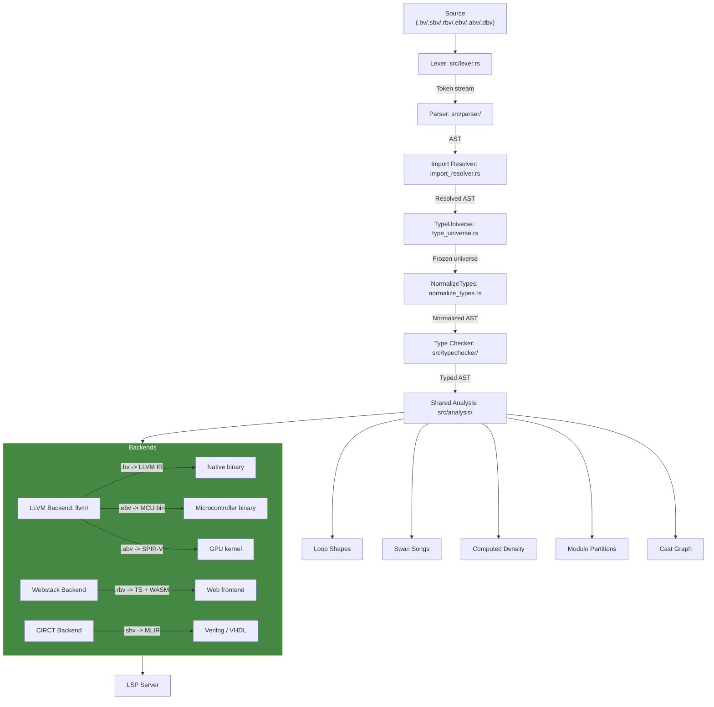

# Briev Compiler Architecture

> Extracted from the README (2026-07-31). The pipeline diagram below is the
> conceptual data flow; see `docs/architecture/` for the deep backend and
> casting-graph documentation, and `docs/plans/2026-07-31-frontend-driven-
> dispatch.md` for the frontend-driven analysis the LLVM backend consumes.

## The frontend-driven principle

The LLVM backend CONSUMES decisions computed once in `AnalysisResults`
(loop shapes, swan-song hoists, density, modulo partitions, inline decisions,
batch shapes) and derives type knowledge from the casting graph — it never
re-derives a decision from a body re-walk, and never matches Briev type names.
Tunables live in `config/targets.toml` + `config/ir-lowering.toml`. See
`docs/architecture/backend-architecture.md`.
